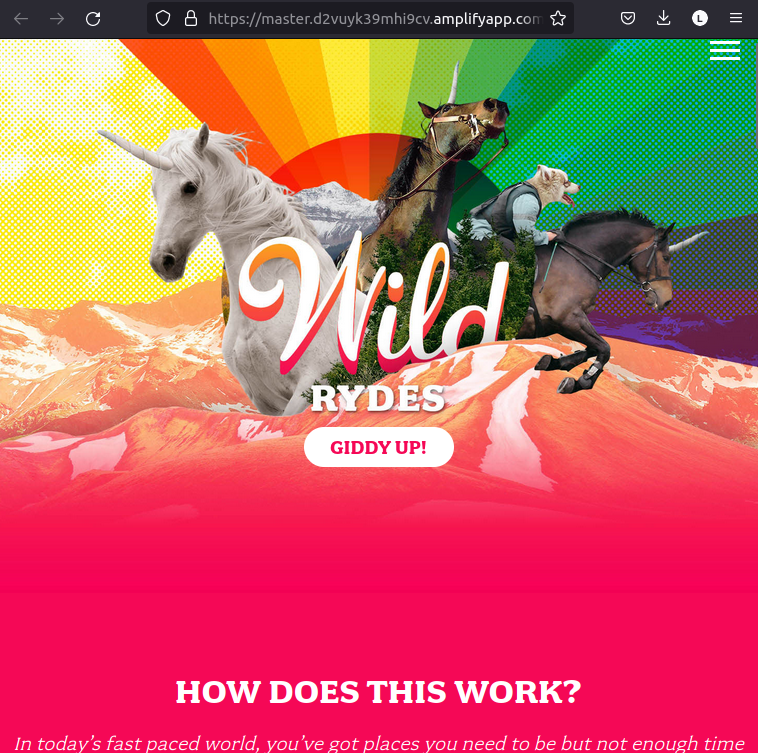
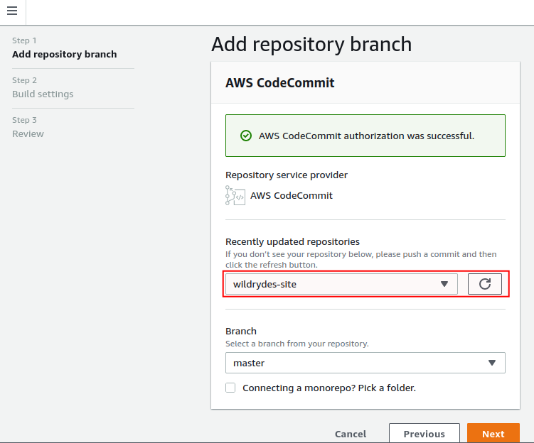
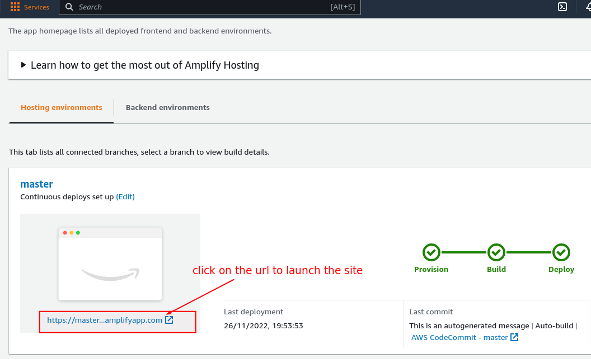
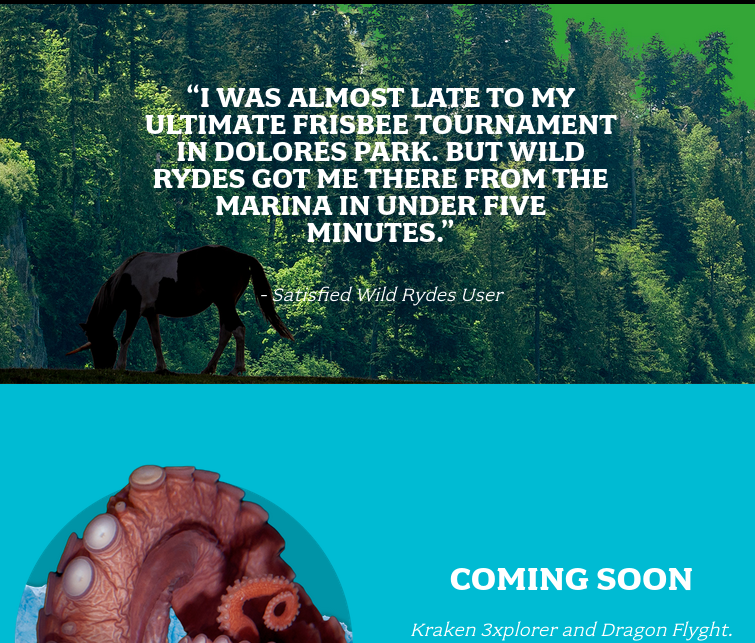
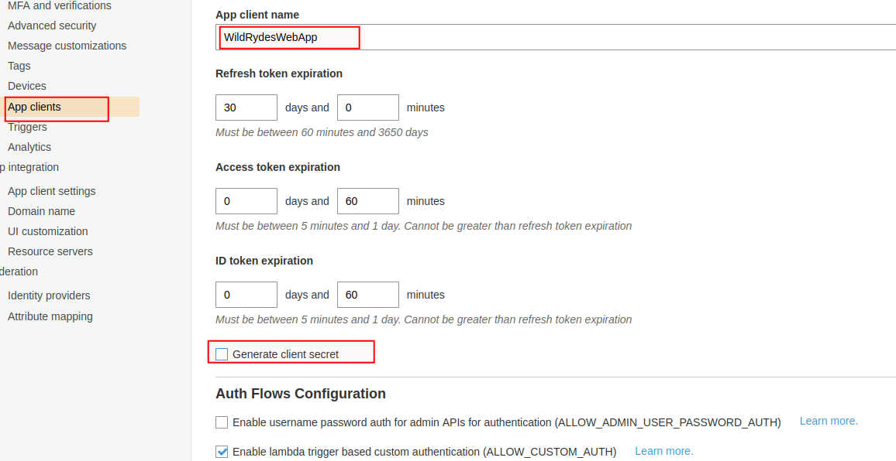
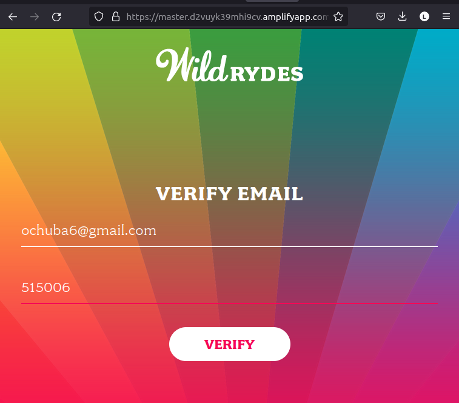
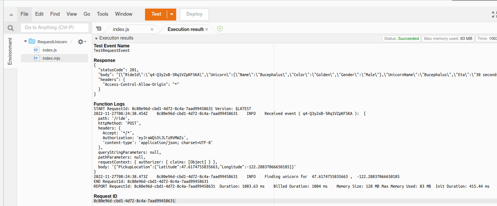
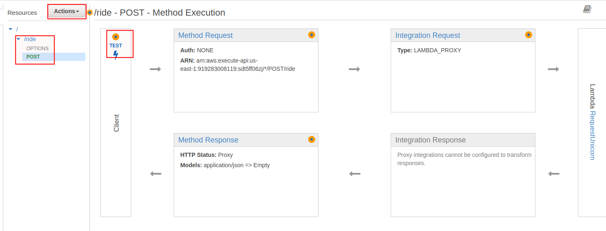

# Build a Serverless Web Application on AWS, Frontend Hosted AWS Amplify
In this hands-on project I created a simple serverless web application where users can signup and request rides indicating pickup location.


## Prerequisites
- An AWS account
- Prior AWS knowledge
- an account with ArcGIS for adding mapping to the app
- a text editor and a browser

## Application Architecture
- The following AWS services will be used
    - AWS Amplify Console
    - Amazon Cognito
    - Amazon API Gateway
    - AWS Lambda
    - Amazon DynamoDB
- Amplify Console provides continuous deployment and hosting of the client interface (HTML, CSS, JavaScript and image files loaded in the browser)
- The client sends request to a public backend API built using Lambda and API Gateway.
- Authentication and user management is provided by Amazon Cognito to secure the backend APIs.
- Data storage is provided by Amazon DynamoDB. Lambda execusion role granted Lambda function for read/write permission to our database.


## STAGE 1 - Static Web Hosting with Continuou Deployment with AWS Amplify
AWS Amplify provides sets of tools and products for easy front-end web development, secure and scalable deployment. It provides a git-based workflow for hosting and continuous deployment of full-stack apps. Provides a public website URL for site accessibility.

1. Region selection
    - Navigate to [AWS Amplify](https://us-east-1.console.aws.amazon.com/console/home?region=us-east-1#) console and
    - select a region of your choice that supports the services. I used the N.Virginia region

2. Create a Repository
    - You can decide to use AWS CodeCommit or GitHub
    - Here I used AWS CodeCommit
    - Head over to [AWS CodeCommit console](https://us-west-2.console.aws.amazon.com/codesuite/codecommit/repositories?region=us-west-2#) and create a repository named `wildrydes-site`
    - follow the [instructions](https://docs.aws.amazon.com/codecommit/latest/userguide/setting-up-gc.html#setting-up-gc-iam) to set up Git credentials for an IAM user in the IAM console
    - Back in the CodeCommit console, From the Clone URL drop down, select Clone HTTPS
    - from your machine terminal run the command, `git clone <https url copied>`. for some reason VS-Code terminal doesn't authenticate with it so use your machine command line tool.
    - provide the git credential username and password downloaded
    

3. Copy source codes to the repository
    - run `cd wildrydes-site`
    - to copy the source code from an associated s3 run `aws s3 cp s3://wildrydes-us-east-1/WebApplication/1_StaticWebHosting/website ./ --recursive`
    - you can run the `ls` command to view copied files
    - run the commands to commit to remote repository
    ```
    git add .
    git commit -m "source code first commit"
    git push
    ```
4. Enable Web Hosting with the AWS Amplify
    - On the AMW Amplify console, click on **Get Started** - **Get started** under *Amplify Hosting*
    - select **AWS CodeCommit** and click **continue**
    - select the `wildrydes-site` repository and branch
    - aknowledge under *Build and testing settings*
    - leave the rest of the settings at defaul and click ***Next***
    - click `Save and deploy`
    - click on the url to launch the static wepsite
    

5. Test continuous deployment
- The AWS Amplify Console will rebuild and redeploy the app when it detects changes to the connected repository. To test this
    - open the `index.html` file in your text editor and make a minor change, save and recommit to your repository.


## STAGE 2 - Authentication and User Management with Amazon Cognito
Create an Amazon Cognito user pool to manage users accounts. Deploy new user registration page. Authenticate users for sign in.

1. Create an Amazon Cognito User Pool
    - Navigate to the Cognito console
    - click on **Manage User Pools** - **Create a User Pool**
    - provide `WildRydes` as pool name and click on *Review Default*
    - click **Create pool**
    - take note of the `Pool id` 

2. Add an App to Your User Pool
    - select ***App clients*** on the left menu of your user pool detail page
    - click on **Add an app client**
    - use `WildRydesWebApp` as the *App client name*
    - `uncheck` *Generate client secret*
    - leave the rest at defaul and click `Create app client`
    - note down the `App client id`
    

3. Update the Website Config
    - Update the js/config.js file with the credentials of the user pool, app client id, and the region you launched your resources
    - navigate to js/config.js
    - provide the necessary details, that is *userPoolId*, *userPoolClientId*, and region. the region is the aws region code where you provisioned your resources e.g us-east-1
    - save the changes and push to your git repository

4. Validate the Implementation
    - on the webpage, click `Giddy Up` to visit the user registration page. 
    - complete the registration form and click on *Let's Ryde* 
    - enter a valid email and password. the password should contain a capital letter, number, and a special character.
    - visit <amplify_endpoint>/verify.html to enter the verification code sent to the email you provided
    - note that the email may be in the *spam* folder. for production deployment, configure your user pool to use Amazon Simple Email Service to send emails from a domain you own.
    - after confirming your registration, visit <amplify_endpoint>/signin.html and login with your credential.
    You will be redirected to /ride.html with a notification that the API is not configured.
    

## STAGE 3 - Build the Serverless backend using AWS Lambda and Amazon DynamoDB
Here, we will implement a Lambday function that will be invoked from the browser using Amazon API Gateway each time a user requests a unicorn. The function will select a unicorn from the fleet, record the request in a DynamoDB table, and then respond to the frontend application with details about the unicorn being dispatched.

1. Create an Amazon DynamoDB Table
    - run the command on your terminal, `aws dynamodb create-table --table-name Rides --attribute-definitions AttributeName=RideId,AttributeType=S --key-schema AttributeName=RideId,KeyType=HASH --provisioned-throughput ReadCapacityUnits=5,WriteCapacityUnits=5 --table-class STANDARD`
    - OR create using the console
    - navigate to the DynamoDB console
    - click on **Create table**
    - enter **Rides** as *Table name*
    - enter `RideId` for the *partition key* and select **String for the key type.
    - check the **Use default settings** box and choose Create.
    - scroll to the buttom and note down the ARN

2. Create IAM Role for Your Lambda Function 
Here we will create IAM role that will grant our lambda function permission to write logs to Amazon CloudWatch Logs and access to write items to your DynamoDB table.
- Navigiate to IAM console, select **Roles** and click **Create Role**
- choose **AWS service** - as *Trusted entity type* 
- select **Lambda** under *Use case* and click ***Next***
- type `AWSLambdaBasicExecutionRole` in the searchbox and select the result.
- enter `WildRydesLambda` as role name, scroll down and click `Create role`
- enter `WildRydesLambda` in the searchbox to select the role you just created by clicking on the name
- on the permission tab, select `Create inline policy` from the `Add permissions` dropdown
- on the `Visual editor` tab, click `Choose a service`
- type `dynamodb` in the searchbox and select it
- type `PutItem` in the searchbox and select it
- click on `Resources` - `Specific` - `Add ARN`
- copy and paste the ARN of the DynamoDB Table created in step 1 above, then click *Add*
- click on **Review policy** and enter `DynamoDBWriteAccess` as name
- click `create policy`

3. Create a Lambda Function for Handling Requests
Here we will build the core function to process the API client requests for a unicorn
- navigate to Lambda console and click on `Create function`
- select `Autho from scratch` if not already selected
- enter `RequestUnicorn` in the *name* field
- select `Node.js 16.x` as *Runtime* NOT `Node.js 18.x` as node18.x image includes the AWS SDK not v2 but v3 according to [this comment](https://github.com/aws/aws-lambda-base-images/issues/47)
- click to expand ***Change default execution role***
- select *Use an existing role* and select `WildRydesLambda` from the drop down and click on `Create function`
- scroll down to *Code source, go to your editor, copy and paste the content of [requestUnicorn.js](./js/requestUnicorn.js)
- click on **Deploy**

4. Validate Implementation
Test the function you just created using the AWS Lambda console
- click on the *Test* tabe and select **Create new event**
- enter `TestRequestEvent` as *Event name*
- copy and past the content of [test-lambda.json](test-lambda.json) into the **Event JSON** editor
- click *save* then click *Test*
- the response should look like , if successful.


## STAGE 4 - Deploy RESTful API
Here we will build a RESTful API using Amazon Gateway to expose the Lambda function built in stage 3.3 above. The API will be accessible on the public internet and protected by the user pool created in stage 2.
1. Create a New REST API
    - Search and navigate to the API Gateway console and click on `Build` under **REST API**
    - ensur `REST` is checked, then select `New API`
    - enter `WildRydes` as *API name*
    - select `Edge optimized` from the *Endpoint Type* dropdown
    - click `Create API`

2. Create a Cognito User Pools Authorizer
    - Here we will create an authorizer for the user pool created earlier such that Amazon API Gateway will use the JWT tokens returned by the Cognito User Pools to authenticate API calls.
    - on the left menu of the newly created API, select *Authorizers
    - click `Create New Authorizer`
    - enter `WildRydes` as *Name*
    - select `Cognito` under *Type* and choose the user pool you created in the input under *Cognito User Pool*
    - enter `Authorization` as *Token Source*
    - click `Create`
    - Verify your Authorizer Configuration
        - open the amplify endpoint and visit `/fide.html`
        - signin if required
        - copy the auth token from the notification on the `/ride.html`
        - go back to the API Authorizer console browser tab
        - paste the authorization token and click *Test*
        - it will return a response code of 200 if successful else 401 error code
    
3. Create a new API endpoint Resource and request method
    - select `Resources` on the left menu bar
    - click on the `Actions` dropdown and select `Create Resources`
    - enter `ride` as *Resource Name* and ensure *Resource Path* is also `ride`
    - check the `Enable API Gateway CORS` and click `Create Resource`
    - while the newly created `/ride` is selected, selecte `Create Method` from the `Actions` dropdown
    - select `POST` under *OPTIONS* and click the *checkmark*
    - ensure **Lambda Function** is selected a `integration type`
    - Check the box for Use Lambda Proxy integration.
    - select the region you created your lambda function
    - enter `RequestUnicorn` to select it under *Lambda Function*
    - click `Save`
    - click `OK` on the prompt to *Add permission to Lambda function*
    - click on the name `Method Request` and click on the pencil icon next to **Authorization**
    - select `WildRydes` under *Cognito user pool authorizer* and click the checkmark icon.
    

4. Deploy Your API
    - click on the **Actions** dropdown and select `Deploy API`
    - select `New Stage` in the **Deployment stage* drop-down list
    - enter `prod` as *Stage Name*
    - click **Deploy**
    - note the `Invoke URL` as you will need it later. this should end witn */prod*

5. Update the Website Config
    - open the /js/config.js file
    - copy the `Invoke URL` from the deployed API console and update the `invokeUrl` in the /js/config.js file
    - save the file and push to your git repository
    

6. Validate your Implementation
    - Visit the `amplify_url_endpoint/ride.html`
    - login to your ArcGIS account
    - After the map has loaded, click anywhere on the map to set a pickup location.
    - Choose Request Unicorn. You should see a notification in the right sidebar that a unicorn is on its way and then see a unicorn icon fly to your pickup location.
    

## STAGE 5 - Resource Cleanup
Terminate all AWS resources you created throughout this tutorial.
- Delete the Amplify app
    - navigate to AWS Amplify console
    - select the app `wildrydes-site`
    - click on `Actions` drop-down and select `Delete App`
    - type *delete* to confirm delete.
- Delete Amazon Cognito User Pool
    - navigate to Cognito console
    - click on ***Manage User Pools*** and select the **WildRydes** created
    - click on **Delete pool**, type *delete* to confirm action
    - click to delete.
- Delete the Serverless Backend
    - Delete the Lambda Function
        - navigate to the **Lambda** console
        - select the `RequestUnicorn` function we created
        - click on **Actions** drop-down and select *Delete*
        - type *delete* to confirm and then click **Delete**
    - Delete the IAM Role
        - navigate to the IAM console and select Roles
        - type *wildRydesLambda into the filter box to select the role
        - click on **Delete** - confirm the role name and click **Delete role**
    - Delete DynamoDB Table
        - select **Tables** on the left menu on the DynamoDB console
        - select the `Rides` table created and click Delete at the top right
        -  Leave the checkbox to Delete all CloudWatch alarms for this table selected and choose Delete.
- Delete the REST API
    - navigate to **API Gateway** console and click on **APIs** on the left navigation menu
    - select the `WildRydes` we created
    - click on `Actions` drop-down then **Delete**
    - click **Delete** again to confirm
- Delete CloudWatch Log
    - navigate to **CloudWatch** console and click on **Logs** - **Log groups**
    - select `/aws/lambda/RequestUnicorn` log group
    - click *Delete log group(s)* from the *Actions* drop-down
    - click *Delete* to confirm

## ***CONGRATULATION...*** 
